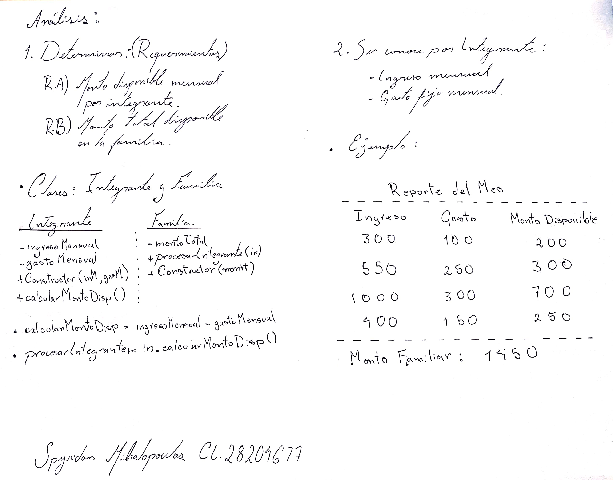

#  Práctica 1: Planteamiento del problema 💻
## Presupuesto Familiar

 
En una familia todos los integrantes trabajan y aportan para los gastos en el hogar. Cada integrante tiene su ingreso y su gasto fijo mensual. 

Se requiere de un programa que determine para cada integrante el monto que dispone mensual, y para la familia también el monto total disponible.

 

## Requerimientos 📋

    a) Monto total disponible por integrante al mes.
    b) Monto total disponible para la Familia.

 

## Analisis 📝
 

 

## Guía 📖
[Ejemplo guia realizado por el profesor](http://theeasyweb.net/profe_prog1)

