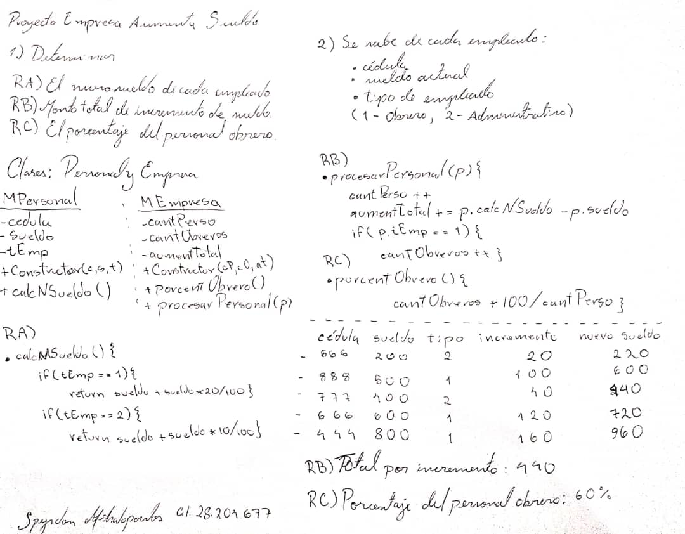

# Practica 2: Planteamiento del problema 💻
## Proyecto Empresa Aumenta Sueldo

 

En una empresa se asignará un aumento del 20% a todo el personal obrero y un 10% al personal administrativo.
Se conoce de cada empleado su cédula, su sueldo actual y el tipo de empleado ( 1-Obrero, 2-Administrativo ).
Al procesar todos los empleados, la empresa desea saber: 

 

## Requerimientos 📋

    a) El nuevo sueldo de cada empleado.
    
    b) El monto total que deberá pagar solo por concepto de incremento de sueldo a todo el personal.
  
    c) El porcentaje del personal obrero. 

 

## Análisis 📝

 

