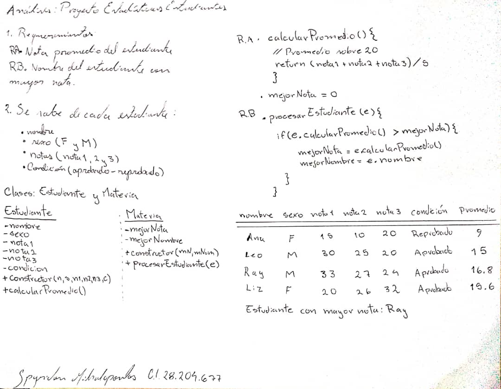

# Práctica 3: Planteamiento del problema 💻
## Proyecto Estadisticas Estudiantes

 

Considere los estudiantes inscritos en cálculo, con sus respectivas notas en cada parcial:

	Ana 15-10-20
	Leo 30-25-20
	Ray 33-27-24
	Liz 20-26-32

Sabiendo que se aprueba con un mínimo de 48, y que se tienen las siguientes interrogantes:

  

## Requerimientos 📋

	a) Nota promedio del estudiante
	b) Nombre del mejor estudiante

 

## Análisis 📝

 

